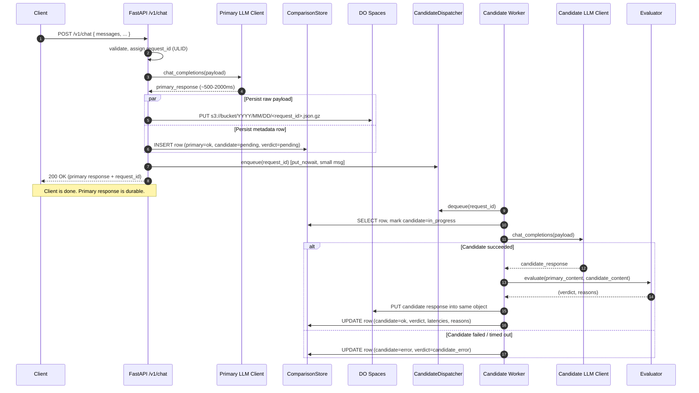
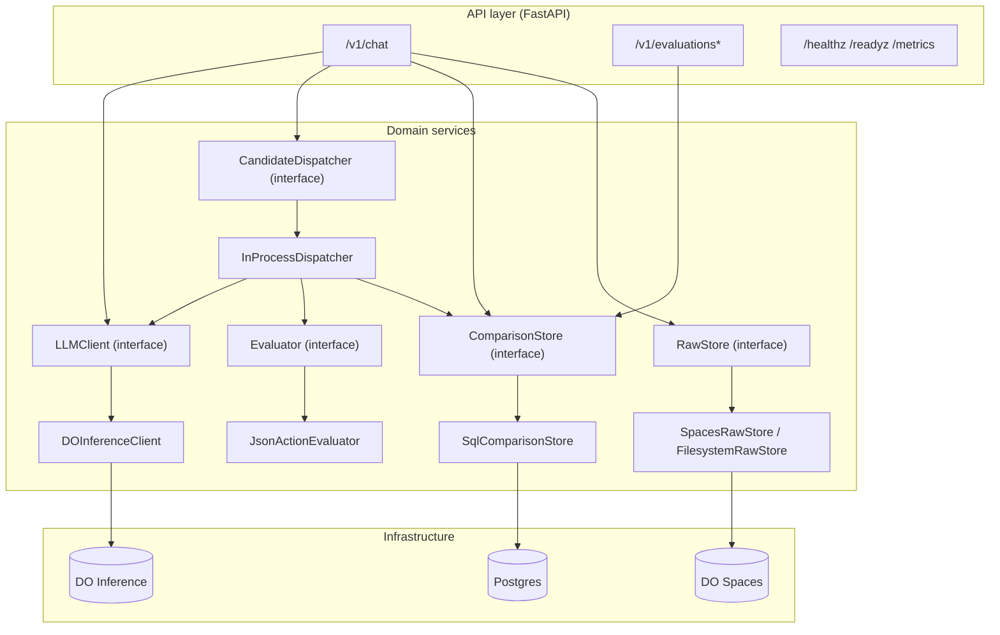
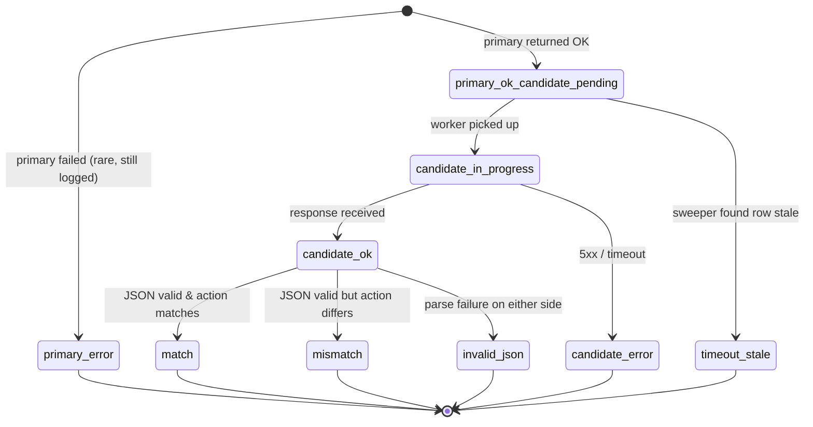
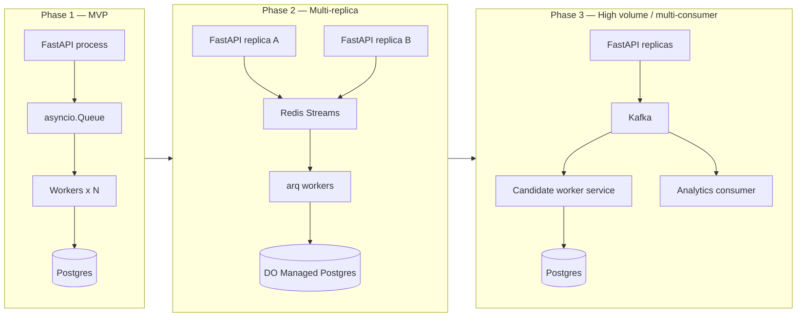
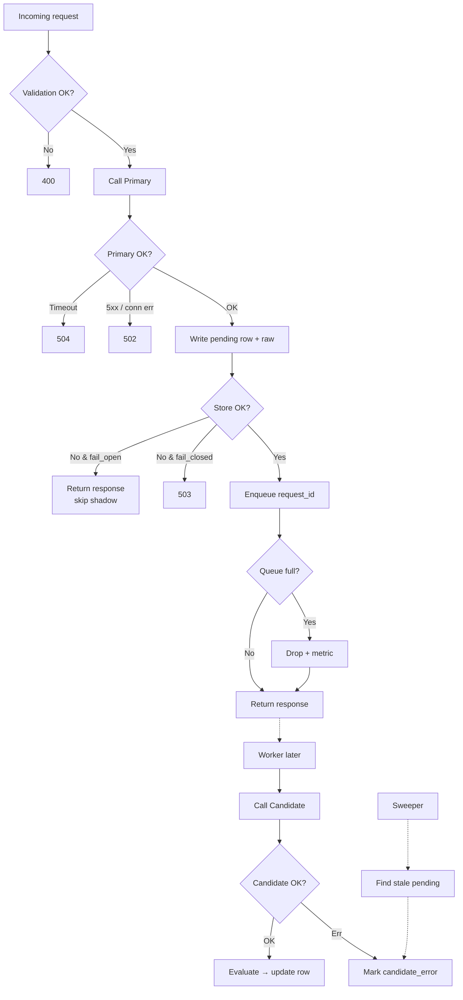

# LLM Shadow Proxy — Architecture Document

> Production-ready API proxy that serves customer traffic through a **Primary LLM** (DigitalOcean Serverless Inference) while asynchronously shadowing the same request to a **Candidate LLM** and evaluating the two responses against deterministic heuristics.

- **Status**: v1 (MVP → scale-ready)
- **Owner**: LLM Platform
- **Repo path**: `/workspaces/llm-shadow-proxy/`

---

## 1. Goals & Non-Goals

### Goals

1. Expose a **synchronous** customer-facing endpoint (`POST /v1/chat`) that proxies to a Primary LLM and returns its response as fast as the model itself allows.
2. **Shadow** every request to a Candidate LLM in the background with **zero impact** on primary latency, errors, or availability.
3. Evaluate primary vs. candidate responses using **deterministic heuristics**:
   - Both responses must be valid, parseable JSON.
   - The `action` key extracted from each must match exactly (after normalization).
4. Persist every comparison **durably before responding to the client**, so no primary response is ever lost — even if the candidate call fails or the proxy crashes.
5. Be **horizontally scalable** and extensible to more routes, more evaluators, and larger traffic without rewrites.

### Non-Goals (v1)

- SSE / streaming responses (Phase 1.5).
- Multi-tenant billing / metering (Phase 2).
- Non-JSON evaluation heuristics (semantic similarity, BLEU, human eval).
- Cross-region replication.

---

## 2. High-Level Architecture

```mermaid
flowchart LR
    Client([Customer / Client]) -->|POST /v1/chat| API[FastAPI App]

    subgraph Proxy["LLM Shadow Proxy (stateless, N replicas)"]
        API --> ReqValidator[Request Validator<br/>Pydantic]
        ReqValidator --> IDGen[Correlation ID<br/>+ Redaction]
        IDGen --> PrimaryCall[Primary LLM Call<br/>httpx.AsyncClient]
        PrimaryCall --> WriteThrough[Persist row<br/>candidate=pending]
        WriteThrough -->|small message| CandQueue[(Bounded<br/>Candidate Queue)]
        WriteThrough --> RespShaper[Response Shaper]
        RespShaper -->|200 OK| Client

        CandQueue --> CandWorkers[Candidate Worker Pool<br/>asyncio tasks]
        CandWorkers --> CandCall[Candidate LLM Call]
        CandCall --> Evaluator[Heuristic Evaluator]
        Evaluator --> StoreUpdate[Update row<br/>verdict, candidate_response]

        Sweeper[Periodic Sweeper<br/>every 5m] --> PendingScan[Find pending > threshold]
        PendingScan --> StoreUpdate
    end

    PrimaryCall -->|HTTPS| DO[(DigitalOcean<br/>Serverless Inference<br/>inference.do-ai.run)]
    CandCall -->|HTTPS| DO

    WriteThrough --> PG[(Postgres<br/>DO Managed DB<br/>structured + JSONB metadata)]
    StoreUpdate --> PG
    WriteThrough -.->|raw payloads gzipped| Spaces[(DO Spaces<br/>S3-compatible object storage)]
    StoreUpdate -.-> Spaces

    ReportAPI[GET /v1/evaluations<br/>Reporting endpoints] --> PG
    Client -->|reports & debugging| ReportAPI

    subgraph Obs["Observability"]
        Metrics[/metrics<br/>Prometheus]
        Logs[Structured JSON logs<br/>stdout]
    end
    API -.-> Metrics
    API -.-> Logs
    CandWorkers -.-> Metrics
    Sweeper -.-> Metrics
```

Key properties:

- **Single deployable** — one FastAPI process runs both the request path and the candidate worker pool. Multiple replicas scale horizontally.
- **Postgres is the source of truth** for state. The queue is a work-notification channel, not a work-storage channel.
- **DO Spaces** stores the full raw payloads (potentially large) keyed by `request_id`, keeping Postgres rows small and fast.
- **All external I/O is async** via `httpx.AsyncClient` and SQLAlchemy 2.0 async.

---

## 3. Request Lifecycle (Sequence)



### Failure isolation contract

- Candidate errors **never** propagate to the client (they occur after the response is sent).
- If the store write fails, policy `on_store_failure=fail_open` returns primary response anyway (default). `fail_closed` returns 503.
- If the queue is full, the message is dropped with a metric bump. The sweeper eventually reconciles the row.
- If the entire pod dies mid-candidate call, startup reconciliation re-enqueues rows where `candidate_status IN ('pending','in_progress')`.

---

## 4. Component Design

### 4.1 Component overview



Every arrow that crosses an interface boundary is **swappable at configuration time** — new LLM providers, new evaluators, new dispatchers, new stores all plug in without touching the API layer.

### 4.2 Key interfaces (contracts)

```python
class LLMClient(Protocol):
    async def chat_completions(self, req: ChatRequest) -> ChatResponse: ...

class Evaluator(Protocol):
    def evaluate(self, primary_text: str, candidate_text: str) -> EvaluationResult: ...

class CandidateDispatcher(Protocol):
    async def enqueue(self, job: CandidateJob) -> DispatchStatus: ...
    async def start(self) -> None: ...
    async def stop(self) -> None: ...

class ComparisonStore(Protocol):
    async def insert_pending(self, record: PendingComparison) -> None: ...
    async def mark_in_progress(self, request_id: str) -> None: ...
    async def finalize(self, request_id: str, patch: FinalizePatch) -> None: ...
    async def get(self, request_id: str) -> ComparisonRecord | None: ...
    async def list(self, filters: EvaluationFilters) -> list[ComparisonRecord]: ...
    async def summary(self, window: timedelta) -> SummaryStats: ...
    async def find_stale(self, threshold: timedelta) -> list[str]: ...

class RawStore(Protocol):
    async def put(self, request_id: str, payload: dict) -> str: ...  # returns object_key
    async def get(self, object_key: str) -> dict: ...
```

### 4.3 Correlation & idempotency

- Every request gets an `X-Request-ID` (ULID) generated on entry if the client didn't send one; echoed in the response header.
- `request_hash = sha256(normalized_request_body)` gives a natural idempotency key. Duplicates are visible in the DB and de-dupable on reporting.

---

## 5. Data Model

### 5.1 Row lifecycle (state machine)



### 5.2 Postgres schema

```sql
CREATE TABLE comparisons (
  request_id           TEXT        PRIMARY KEY,       -- ULID
  received_at          TIMESTAMPTZ NOT NULL,
  route                TEXT        NOT NULL DEFAULT 'default',
  tenant_id            TEXT,
  session_id           TEXT,
  request_hash         TEXT        NOT NULL,
  raw_object_key       TEXT,                          -- points into DO Spaces

  primary_model        TEXT        NOT NULL,
  primary_status       TEXT        NOT NULL,          -- 'ok' | 'error' | 'timeout'
  primary_latency_ms   INTEGER     NOT NULL,
  primary_action       TEXT,
  primary_error        TEXT,

  candidate_model      TEXT        NOT NULL,
  candidate_status     TEXT        NOT NULL DEFAULT 'pending',
                                                       -- 'pending'|'in_progress'|'ok'|'error'|'timeout_stale'|'dropped'
  candidate_latency_ms INTEGER,
  candidate_action     TEXT,
  candidate_error      TEXT,

  verdict              TEXT        NOT NULL DEFAULT 'pending',
                                                       -- 'pending'|'match'|'mismatch'|'invalid_json'|'candidate_error'|'primary_error'
  reasons              JSONB       NOT NULL DEFAULT '[]'::jsonb,
  attempt_count        INTEGER     NOT NULL DEFAULT 0,
  last_attempted_at    TIMESTAMPTZ,
  evaluated_at         TIMESTAMPTZ
);

CREATE INDEX idx_comparisons_received_at ON comparisons(received_at DESC);
CREATE INDEX idx_comparisons_verdict     ON comparisons(verdict);
CREATE INDEX idx_comparisons_route       ON comparisons(route);
CREATE INDEX idx_comparisons_tenant      ON comparisons(tenant_id);
-- partial index makes the sweeper's scan O(pending rows), not O(table size)
CREATE INDEX idx_comparisons_pending
  ON comparisons(received_at)
  WHERE candidate_status IN ('pending', 'in_progress');
```

### 5.3 DO Spaces object layout

- Bucket: `llm-shadow-proxy-raw-<env>`
- Key: `raw/{YYYY}/{MM}/{DD}/{request_id}.json.gz`
- Contents:
  ```json
  {
    "request": { "messages": [...], "temperature": 0.0, ... },
    "primary_response": { ... full DO response ... },
    "candidate_response": { ... },   // added later; may be null on first write
    "primary_model": "...",
    "candidate_model": "...",
    "written_at": "2026-07-16T09:00:00Z"
  }
  ```
- Rationale: keeps Postgres rows small (~500 bytes each) even when LLM responses are 5-50 KB; retention on Spaces is cheap and independent of DB.

---

## 6. API Contracts

All endpoints are under `/v1/`. Full request/response docs are also auto-generated at `/docs` (Swagger UI) and `/openapi.json`.

### 6.1 `POST /v1/chat`

**Request**

```json
{
  "messages": [
    { "role": "system", "content": "You are a router. Reply as JSON {\"action\": \"...\"}." },
    { "role": "user", "content": "book a flight to Paris" }
  ],
  "temperature": 0.0,
  "max_completion_tokens": 256,
  "metadata": {
    "tenant_id": "acme",
    "session_id": "sess_abc"
  }
}
```

Notes:
- `model` is **not** in the request — the proxy config decides based on `route` (default: `"default"`).
- `metadata` is optional; tenant/session are for reporting.

**Response** — `200 OK`

```json
{
  "request_id": "01HZQ...",
  "primary_model": "llama3.3-70b-instruct",
  "response": {
    "id": "chatcmpl-...",
    "object": "chat.completion",
    "choices": [
      {
        "index": 0,
        "message": { "role": "assistant", "content": "{\"action\":\"book_flight\"}" },
        "finish_reason": "stop"
      }
    ],
    "usage": { "prompt_tokens": 42, "completion_tokens": 8, "total_tokens": 50 }
  }
}
```

**Headers**

| Direction | Header | Purpose |
| --- | --- | --- |
| Request | `Authorization: Bearer <proxy-api-key>` | Simple bearer auth for MVP |
| Request | `X-Request-ID` | Optional; generated if missing |
| Response | `X-Request-ID` | Correlation |
| Response | `X-Primary-Model` | Which model served the request |
| Response | `X-Shadow-Enqueued` | `true` if shadow accepted; `false` if dropped |

**Status codes**

| Code | Meaning |
| --- | --- |
| 200 | Primary succeeded |
| 400 | Validation error |
| 401/403 | Proxy auth failure |
| 429 | Proxy rate limit |
| 502 | Primary LLM upstream failure |
| 504 | Primary LLM timeout |
| 503 | Store failure while in `fail_closed` policy |

### 6.2 `GET /v1/evaluations`

Query: `since`, `until`, `verdict`, `route`, `tenant_id`, `limit`, `cursor`.
Returns paginated `ComparisonRecord[]`.

### 6.3 `GET /v1/evaluations/{request_id}`

Full record including `primary_action`, `candidate_action`, `reasons`, and links to raw payloads.

### 6.4 `GET /v1/evaluations/summary`

```json
{
  "window": "24h",
  "primary_model": "llama3.3-70b-instruct",
  "candidate_model": "openai-gpt-oss-120b",
  "total": 12480,
  "match_rate": 0.947,
  "verdicts": { "match": 11816, "mismatch": 512, "invalid_json": 98, "candidate_error": 54 },
  "latency_p50_ms": { "primary": 720, "candidate": 810 },
  "latency_p95_ms": { "primary": 1450, "candidate": 1620 }
}
```

### 6.5 Ops endpoints

- `GET /healthz` — liveness (200 if process is up)
- `GET /readyz` — readiness (checks DB + candidate queue capacity)
- `GET /metrics` — Prometheus text format
- `GET /v1/config` — non-secret runtime config

---

## 7. Configuration

### 7.1 `config/models.yaml`

```yaml
routes:
  default:
    primary:
      model_id: "llama3.3-70b-instruct"
      timeout_s: 15
      max_retries: 1
    candidate:
      model_id: "openai-gpt-oss-120b"
      timeout_s: 30
      max_retries: 0

evaluator:
  require_json: true
  compare_key: "action"
  normalize: "lowercase_strip"

dispatcher:
  type: "in_process"          # in_process | redis_streams | kafka
  queue_capacity: 10000
  workers: 8
  overflow_policy: "drop_new" # drop_new | drop_old

store:
  on_failure: "fail_open"     # fail_open | fail_closed
  sweeper_interval_s: 300
  stale_threshold_s: 600

raw_store:
  type: "filesystem"          # filesystem | spaces
  filesystem_path: "./data/raw"
  spaces:
    bucket: "llm-shadow-proxy-raw"
    region: "nyc3"
    endpoint_url: "https://nyc3.digitaloceanspaces.com"
```

### 7.2 `.env` (secrets only)

```
DO_INFERENCE_BASE_URL=https://inference.do-ai.run/v1
DO_INFERENCE_API_KEY=***
PROXY_API_KEYS=key1,key2
DATABASE_URL=sqlite+aiosqlite:///./data/comparisons.db
DO_SPACES_KEY=***
DO_SPACES_SECRET=***
LOG_LEVEL=INFO
```

---

## 8. Evaluation Rules

Deterministic, pure function; unit-testable. Semantics:

1. Extract `content` from `choices[0].message.content` on both sides.
2. If `content` is fenced (```` ```json ... ``` ````), strip fences.
3. Attempt `json.loads` on each side.
   - Failure on either side → **verdict = `invalid_json`**.
4. Extract `action` key from both parsed objects.
   - Missing on either side → **verdict = `mismatch`**, reason `missing_action_key`.
5. Normalize (lowercase + strip whitespace) and compare.
   - Equal → **verdict = `match`**.
   - Otherwise → **verdict = `mismatch`**, reason `action_mismatch:<p>!=<c>`.

Pluggable: `Evaluator` is an interface; future implementations can compare arbitrary JSON keys, JSONPath expressions, tool-call structure, or semantic similarity — no changes to the pipeline needed.

---

## 9. Technology Choices — What & Why

| Concern | Choice | Why |
| --- | --- | --- |
| Web framework | **FastAPI** | Async-native, Pydantic v2 integrated, best-in-class DX for typed APIs, huge ecosystem, easy SSE later. |
| ASGI server | **Uvicorn + Gunicorn** | Standard production combo; Gunicorn for process supervision, Uvicorn workers for async I/O. |
| HTTP client | **httpx.AsyncClient** | Async, connection pooling, HTTP/2, timeouts per-call, works well with OpenAI SDK's `http_client` param. |
| LLM SDK | **openai** Python SDK, pointed at DO base URL | DO Serverless Inference is OpenAI-compatible; SDK gives typed responses, streaming, retries. |
| Structured DB | **Postgres (DO Managed Postgres in prod, SQLite in dev)** with SQLAlchemy 2.0 async | Structured metadata + `JSONB` for semi-structured fields, rich aggregations, mature ops. See §12 for why not NoSQL. |
| Raw payload store | **DO Spaces (S3-compatible)**, filesystem in dev | Cheap unlimited storage for large raw payloads; keeps hot DB small; independent retention. |
| Config | **pydantic-settings + YAML** | Typed config, env-var overrides, one source of truth. |
| Logging | **structlog** JSON to stdout | Structured JSON logs are ingestible by any log platform; correlation ID threaded through. |
| Metrics | **prometheus-client** at `/metrics` | Ubiquitous, works with DO managed monitoring, Grafana. |
| Task queue (MVP) | **In-process asyncio.Queue with N workers** | Zero extra infra; sufficient for hundreds of RPS per replica; bounded and drop-metric'd. |
| Task queue (Phase 2) | **Redis Streams + arq** | Durable, multi-replica, replayable, minimal ops overhead. |
| Testing | **pytest + pytest-asyncio + httpx.AsyncClient** | Standard async test stack; fast; deterministic. |
| Container | **Python 3.13 slim + uv** | Small image; `uv` is fast for installs. |
| Deploy | **DO App Platform → DOKS** as we scale | Already on DO, VPC-scoped model keys, zero-friction. |

### Why FastAPI over the alternatives

- Litestar: comparable perf, smaller ecosystem — not worth the switch.
- aiohttp: better as a client than a server; less DX.
- Django async: sync-first ORM mindset; wrong tool for I/O-heavy proxy.
- Node/Go rewrite: The workload is 99% I/O-bound; language runtime doesn't matter. Scaling is about workers + queue, not language.

---

## 10. Concurrency & Scaling



Scaling levers (in order of when to pull them):

1. Bump `dispatcher.workers` and `queue_capacity`.
2. Run more Uvicorn workers per replica (`--workers`).
3. Run more replicas (horizontal scale-out) — safe because Postgres is source of truth.
4. Move dispatcher from `in_process` → `redis_streams` (config flip, code already abstracted).
5. Move raw store from filesystem → DO Spaces (config flip).
6. Migrate to Kafka / RabbitMQ if consumer diversity demands it.

Isolation invariants that scaling must preserve:

- Primary and candidate use **separate `httpx.AsyncClient` pools**, so candidate saturation cannot starve primary.
- Timeouts are per-call and per-side, independent.
- Backpressure is visible (`candidate_queue_depth`, `candidate_dropped_total`, `sweeper_reconciled_total`).

---

## 11. Reliability & Failure Handling



Retry policy:

- Primary: up to 1 retry with 100 ms jittered backoff on `429`, `5xx`, or connection errors. No retry on timeouts (would risk duplicates).
- Candidate: 0 retries by default; the sweeper handles the "never processed" case.

Timeouts (defaults):

- Primary: 15s (config), aggressive because the client is waiting.
- Candidate: 30s (config), generous because it's background.
- DB writes: 5s.

---

## 12. Storage Choice — Why Postgres + Object Store, Not MongoDB

This was an explicit design decision.

| Property | This workload | SQL wins | NoSQL wins |
| --- | --- | --- | --- |
| Point lookup by `request_id` | Yes | ✓ | ✓ |
| Filtered range queries (verdict, time, tenant) | Yes | ✓ | Awkward |
| Aggregations (match rate, p95 latency) | **Daily use** | ✓ | Weak |
| Variable-shape JSON in the *queried* columns | No — only in blob columns | JSONB handles blobs | Native |
| Extreme write throughput (>10k/s) | Not yet | Postgres handles this scale | ✓ |
| Ops burden | We're on DO | Managed Postgres = zero-ops | Managed Mongo = zero-ops |

**Verdict**: Postgres + JSONB for structured metadata, DO Spaces for large raw payloads. Best of both worlds; no aggregation compromises.

---

## 13. Directory Layout

```
llm-shadow-proxy/
├── docs/
│   └── Architecture_Doc.md          ← this document
├── config/
│   └── models.yaml
├── src/shadow_proxy/
│   ├── main.py                      # FastAPI app factory + lifespan
│   ├── settings.py                  # pydantic-settings
│   ├── api/
│   │   ├── health.py
│   │   └── v1/
│   │       ├── chat.py              # POST /v1/chat
│   │       └── evaluations.py       # GET /v1/evaluations*
│   ├── llm/
│   │   ├── base.py                  # LLMClient protocol + models
│   │   └── do_inference.py          # DOInferenceClient
│   ├── dispatcher/
│   │   ├── base.py                  # CandidateDispatcher protocol
│   │   └── in_process.py            # bounded queue + worker pool
│   ├── evaluator/
│   │   ├── base.py
│   │   └── json_action.py
│   ├── store/
│   │   ├── base.py                  # ComparisonStore protocol
│   │   ├── models.py                # SQLAlchemy tables
│   │   ├── sql.py                   # SqlComparisonStore
│   │   └── raw.py                   # RawStore: filesystem + Spaces
│   ├── observability/
│   │   ├── logging.py
│   │   └── metrics.py
│   ├── sweeper.py                   # periodic reconciler
│   └── util/
│       ├── ids.py
│       ├── redact.py
│       └── hashing.py
├── tests/
│   ├── unit/
│   └── integration/
├── scripts/
├── docker/
│   └── Dockerfile
├── docker-compose.yml
├── pyproject.toml
├── .env.example
├── .gitignore
└── README.md
```

---

## 14. Deployment

- **Local dev**: `docker compose up` brings Postgres + the proxy; raw store is filesystem.
- **Prod (DO App Platform)**:
  - App Platform picks up `docker/Dockerfile`.
  - Env vars: `DO_INFERENCE_API_KEY`, `DATABASE_URL` (points at Managed Postgres), `DO_SPACES_*`.
  - Auto-scale on CPU/RPS.
  - Model access key scoped to the App Platform VPC.
- **Prod (DOKS, when needed)**: same container, HPA, Managed Postgres, optional Managed Redis for Phase 2.

Rough MVP sizing: 2 replicas × 2 vCPU / 2 GB, Uvicorn `--workers 2` each. Handles hundreds of RPS since work is I/O-bound.

---

## 15. Roll-out Plan

1. Deploy behind an internal API key with a single trusted caller.
2. Watch `/v1/evaluations/summary` for `match_rate` and error rates against synthetic traffic.
3. Gradually raise real traffic percentage (10 → 50 → 100%) via the calling application.
4. Alert on: `match_rate < threshold`, `candidate_error_rate > threshold`, `candidate_queue_depth` sustained > 80%.

---

## 16. Open Items / Future Work

- [ ] SSE streaming variant `POST /v1/chat/stream`.
- [ ] Redis Streams dispatcher (Phase 2).
- [ ] JSONPath / multi-key evaluator.
- [ ] Per-tenant rate limiting.
- [ ] PII redaction in stored payloads.
- [ ] Retention policy (auto-archive rows older than N days to Spaces cold storage).
- [ ] OpenTelemetry tracing.
