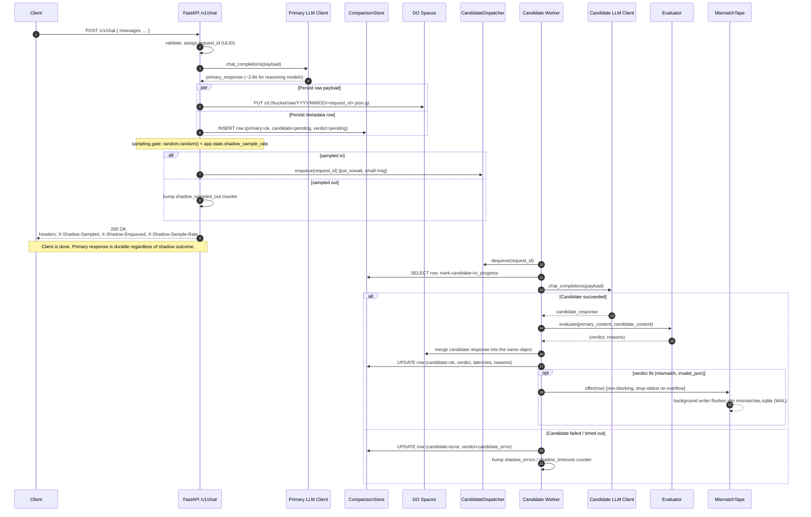
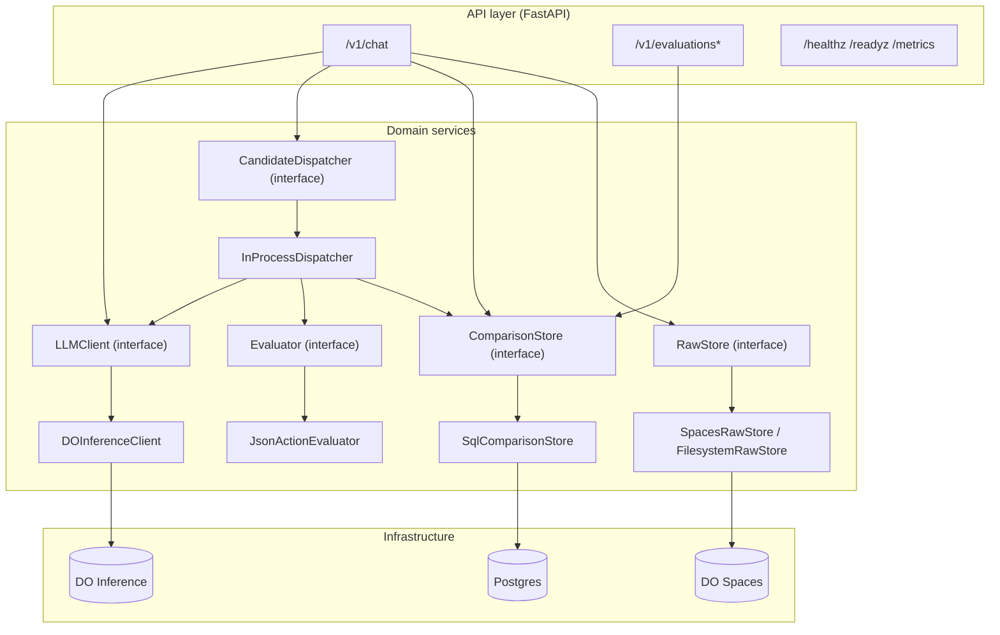
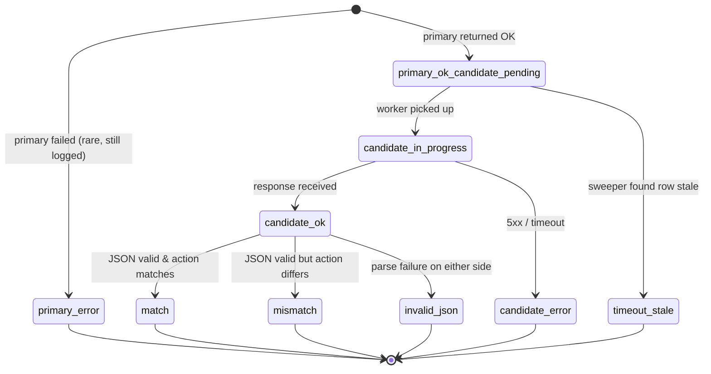
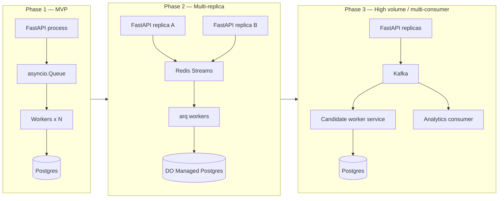
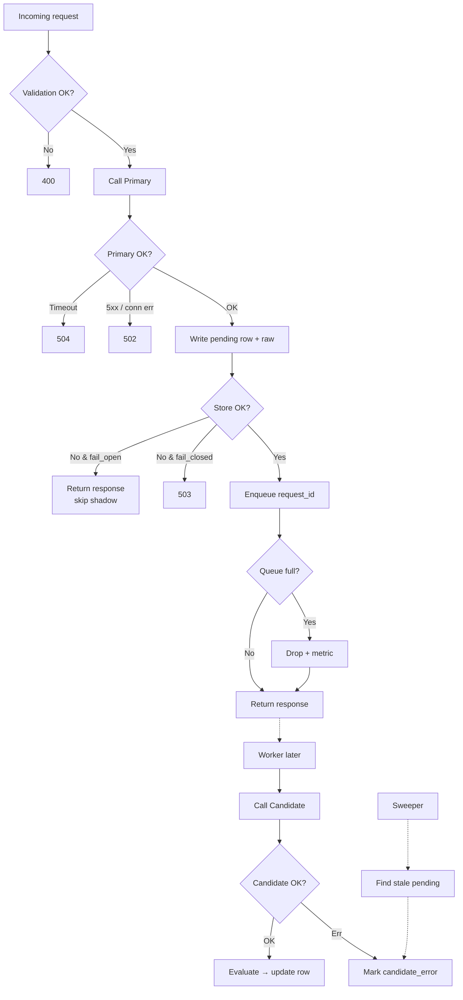

# LLM Shadow Proxy — Architecture Document

> Production-ready API proxy that serves customer traffic through a **Primary LLM** (DigitalOcean Serverless Inference) while asynchronously shadowing the same request to a **Candidate LLM** and evaluating the two responses against deterministic heuristics.

- **Status**: v1.1 — MVP shipped with live-tuning, mismatch tape, and full raw-payload inspection
- **Owner**: LLM Platform
- **Repo path**: `/workspaces/llm-shadow-proxy/`
- **Deployed to**: DO App Platform (`.do/app.yaml` at repo root)
- **Active model pair**: primary `openai-gpt-oss-120b`, candidate `openai-gpt-oss-20b` (both DO Serverless Inference)
- **Companion doc**: [`Demo_Flow.md`](./Demo_Flow.md) — end-to-end walkthrough and talking track

---

## 1. Goals & Non-Goals

### Goals

1. Expose a **synchronous** customer-facing endpoint (`POST /v1/chat`) that proxies to a Primary LLM and returns its response as fast as the model itself allows.
2. **Shadow** every request to a Candidate LLM in the background with **zero impact** on primary latency, errors, or availability.
3. Evaluate primary vs. candidate responses using **deterministic heuristics**:
   - Both responses must be valid, parseable JSON.
   - The `action` key extracted from each must match exactly (after normalization).
4. Persist every comparison **durably before responding to the client**, so no primary response is ever lost — even if the candidate call fails or the proxy crashes.
5. Be **horizontally scalable** and extensible to more routes, more evaluators, and larger traffic without rewrites.

6. Provide **live operational knobs** so the mirroring percentage can be dialed down without a redeploy once the candidate has been vetted.
7. Provide a **debug-friendly artifact stream** — the mismatch tape — so mismatched or invalid-JSON cases can be inspected offline without querying the OLTP path.

### Non-Goals (v1)

- SSE / streaming responses (Phase 1.5).
- Multi-tenant billing / metering (Phase 2).
- Non-JSON evaluation heuristics (semantic similarity, BLEU, human eval).
- Cross-region replication.
- Cluster-wide propagation of the `PUT /v1/config` sample rate (currently per-replica).

---

## 2. High-Level Architecture

```mermaid
flowchart LR
    Client([Customer / Client]) -->|POST /v1/chat| API[FastAPI App]

    subgraph Proxy["LLM Shadow Proxy (stateless, N replicas)"]
        API --> ReqValidator[Request Validator<br/>Pydantic]
        ReqValidator --> IDGen[Correlation ID<br/>+ Redaction]
        IDGen --> PrimaryCall[Primary LLM Call<br/>httpx.AsyncClient]
        PrimaryCall --> WriteThrough[Persist row<br/>candidate=pending]
        WriteThrough --> SampleGate{shadow_sample_rate<br/>random.random&lt;rate?}
        SampleGate -->|sampled in| CandQueue[(Bounded<br/>Candidate Queue)]
        SampleGate -->|sampled out| Skip[skip shadow<br/>+bump counter]
        WriteThrough --> RespShaper[Response Shaper]
        RespShaper -->|200 OK<br/>+X-Shadow-Sampled/Enqueued| Client

        CandQueue --> CandWorkers[Candidate Worker Pool<br/>asyncio tasks]
        CandWorkers --> CandCall[Candidate LLM Call]
        CandCall --> Evaluator[Heuristic Evaluator]
        Evaluator --> StoreUpdate[Update row<br/>verdict, candidate_response]
        Evaluator -->|verdict=mismatch<br/>or invalid_json| TapeQ[(asyncio.Queue<br/>mismatch tape)]
        TapeQ --> TapeWriter[Background writer]
        TapeWriter --> TapeDB[(mismatches.sqlite<br/>WAL, denormalized)]

        Sweeper[Periodic Sweeper<br/>every 5m] --> PendingScan[Find pending &gt; threshold]
        PendingScan --> StoreUpdate

        AdminAPI[PUT /v1/config<br/>runtime knob] -.->|mutates<br/>shadow_sample_rate| SampleGate
    end

    PrimaryCall -->|HTTPS| DO[(DigitalOcean<br/>Serverless Inference<br/>inference.do-ai.run)]
    CandCall -->|HTTPS| DO

    WriteThrough --> PG[(SQLite dev / Postgres prod<br/>comparisons table)]
    StoreUpdate --> PG
    WriteThrough -.->|raw payloads gzipped| Spaces[(DO Spaces<br/>llm-proxy-prod bucket)]
    StoreUpdate -.-> Spaces

    ReportAPI[GET /v1/evaluations*<br/>GET /v1/evaluations/id/raw<br/>GET /v1/metrics] --> PG
    ReportAPI --> Spaces
    Client -->|reports & debugging| ReportAPI

    subgraph Obs["Observability"]
        PromMetrics[/metrics<br/>Prometheus text]
        BizMetrics[/v1/metrics<br/>business JSON]
        Logs[Structured JSON logs<br/>stdout]
    end
    API -.-> PromMetrics
    API -.-> BizMetrics
    API -.-> Logs
    CandWorkers -.-> PromMetrics
    Sweeper -.-> PromMetrics
```

Key properties:

- **Single deployable** — one FastAPI process runs the request path, the candidate worker pool, the sweeper, and the mismatch tape writer. Multiple replicas scale horizontally.
- **SQL store is the source of truth** for state (SQLite in dev, Postgres in prod). The queue is a work-notification channel, not a work-storage channel.
- **DO Spaces** stores the full raw LLM payloads (potentially large, includes `reasoning_content` for reasoning models) keyed by `request_id`, keeping SQL rows small and fast.
- **Dedicated mismatch tape** (a separate `mismatches.sqlite` file) streams mismatched or invalid-JSON payloads for offline analysis, independent of the OLTP table.
- **Dynamic shadow sampling** — a mutable `shadow_sample_rate` on `app.state` gates traffic mirroring at request time; `PUT /v1/config` updates it live without a restart.
- **All external I/O is async** via `httpx.AsyncClient`, SQLAlchemy 2.0 async, and `aioboto3` for Spaces.

---

## 3. Request Lifecycle (Sequence)



### Failure isolation contract

- Candidate errors **never** propagate to the client (they occur after the response is sent).
- If the store write fails, policy `on_store_failure=fail_open` returns primary response anyway (default). `fail_closed` returns 503.
- If the queue is full, the message is dropped with a metric bump. The sweeper eventually reconciles the row.
- If the entire pod dies mid-candidate call, startup reconciliation re-enqueues rows where `candidate_status IN ('pending','in_progress')`.

---

## 4. Component Design

### 4.1 Component overview



Every arrow that crosses an interface boundary is **swappable at configuration time** — new LLM providers, new evaluators, new dispatchers, new stores all plug in without touching the API layer.

### 4.2 Key interfaces (contracts)

```python
class LLMClient(Protocol):
    async def chat_completions(self, req: ChatRequest) -> ChatResponse: ...

class Evaluator(Protocol):
    def evaluate(self, primary_text: str, candidate_text: str) -> EvaluationResult: ...

class CandidateDispatcher(Protocol):
    async def enqueue(self, job: CandidateJob) -> DispatchStatus: ...
    async def start(self) -> None: ...
    async def stop(self) -> None: ...

class ComparisonStore(Protocol):
    async def insert_pending(self, record: PendingComparison) -> None: ...
    async def mark_in_progress(self, request_id: str) -> None: ...
    async def finalize(self, request_id: str, patch: FinalizePatch) -> None: ...
    async def get(self, request_id: str) -> ComparisonRecord | None: ...
    async def list(self, filters: EvaluationFilters) -> list[ComparisonRecord]: ...
    async def summary(self, window: timedelta) -> SummaryStats: ...
    async def find_stale(self, threshold: timedelta) -> list[str]: ...

class RawStore(Protocol):
    async def put(self, request_id: str, payload: dict) -> str: ...  # returns object_key
    async def get(self, object_key: str) -> dict: ...
```

### 4.3 Correlation & idempotency

- Every request gets an `X-Request-ID` (ULID) generated on entry if the client didn't send one; echoed in the response header.
- `request_hash = sha256(normalized_request_body)` gives a natural idempotency key. Duplicates are visible in the DB and de-dupable on reporting.

---

## 5. Data Model

### 5.1 Row lifecycle (state machine)



### 5.2 Postgres schema

```sql
CREATE TABLE comparisons (
  request_id           TEXT        PRIMARY KEY,       -- ULID
  received_at          TIMESTAMPTZ NOT NULL,
  route                TEXT        NOT NULL DEFAULT 'default',
  tenant_id            TEXT,
  session_id           TEXT,
  request_hash         TEXT        NOT NULL,
  raw_object_key       TEXT,                          -- points into DO Spaces

  primary_model        TEXT        NOT NULL,
  primary_status       TEXT        NOT NULL,          -- 'ok' | 'error' | 'timeout'
  primary_latency_ms   INTEGER     NOT NULL,
  primary_action       TEXT,
  primary_error        TEXT,

  candidate_model      TEXT        NOT NULL,
  candidate_status     TEXT        NOT NULL DEFAULT 'pending',
                                                       -- 'pending'|'in_progress'|'ok'|'error'|'timeout_stale'|'dropped'
  candidate_latency_ms INTEGER,
  candidate_action     TEXT,
  candidate_error      TEXT,

  verdict              TEXT        NOT NULL DEFAULT 'pending',
                                                       -- 'pending'|'match'|'mismatch'|'invalid_json'|'candidate_error'|'primary_error'
  reasons              JSONB       NOT NULL DEFAULT '[]'::jsonb,
  attempt_count        INTEGER     NOT NULL DEFAULT 0,
  last_attempted_at    TIMESTAMPTZ,
  evaluated_at         TIMESTAMPTZ
);

CREATE INDEX idx_comparisons_received_at ON comparisons(received_at DESC);
CREATE INDEX idx_comparisons_verdict     ON comparisons(verdict);
CREATE INDEX idx_comparisons_route       ON comparisons(route);
CREATE INDEX idx_comparisons_tenant      ON comparisons(tenant_id);
-- partial index makes the sweeper's scan O(pending rows), not O(table size)
CREATE INDEX idx_comparisons_pending
  ON comparisons(received_at)
  WHERE candidate_status IN ('pending', 'in_progress');
```

### 5.3 DO Spaces object layout

- Bucket: `llm-shadow-proxy-raw-<env>`
- Key: `raw/{YYYY}/{MM}/{DD}/{request_id}.json.gz`
- Contents:
  ```json
  {
    "request": { "messages": [...], "temperature": 0.0, ... },
    "primary_response": { ... full DO response ... },
    "candidate_response": { ... },   // added later; may be null on first write
    "primary_model": "...",
    "candidate_model": "...",
    "written_at": "2026-07-16T09:00:00Z"
  }
  ```
- Rationale: keeps Postgres rows small (~500 bytes each) even when LLM responses are 5-50 KB; retention on Spaces is cheap and independent of DB.

---

## 6. API Contracts

All endpoints are under `/v1/`. Full request/response docs are also auto-generated at `/docs` (Swagger UI) and `/openapi.json`.

### 6.1 `POST /v1/chat`

**Request**

```json
{
  "messages": [
    { "role": "system", "content": "You are a router. Reply as JSON {\"action\": \"...\"}." },
    { "role": "user", "content": "book a flight to Paris" }
  ],
  "temperature": 0.0,
  "max_completion_tokens": 256,
  "metadata": {
    "tenant_id": "acme",
    "session_id": "sess_abc"
  }
}
```

Notes:
- `model` is **not** in the request — the proxy config decides based on `route` (default: `"default"`).
- `metadata` is optional; tenant/session are for reporting.

**Response** — `200 OK`

```json
{
  "request_id": "01KXN6F8DSDX0ERRW3RF4BBND2",
  "primary_model": "openai-gpt-oss-120b",
  "response": {
    "id": "chatcmpl-...",
    "object": "chat.completion",
    "choices": [
      {
        "index": 0,
        "message": {
          "role": "assistant",
          "content": "{\"action\":\"cancel\"}",
          "reasoning_content": "The user says 'cancel my subscription' → action=cancel..."
        },
        "finish_reason": "stop"
      }
    ],
    "usage": { "prompt_tokens": 95, "completion_tokens": 42, "total_tokens": 137 }
  }
}
```

> **Note on `reasoning_content`**: DO's `openai-gpt-oss-*` models are reasoning models — they emit internal thinking on `choices[0].message.reasoning_content` before the visible `choices[0].message.content`. That reasoning consumes completion tokens, so `max_completion_tokens` must be generous (≥ 1024). At 256 tokens the answer routinely gets cut off with `finish_reason=length` and `content: null`.

**Headers**

| Direction | Header | Purpose |
| --- | --- | --- |
| Request | `Authorization: Bearer <proxy-api-key>` | Simple bearer auth (disabled when `PROXY_API_KEYS` empty) |
| Request | `X-Request-ID` | Optional; generated (ULID) if missing |
| Response | `X-Request-ID` | Correlation |
| Response | `X-Primary-Model` | Which model served the request |
| Response | `X-Shadow-Sampled` | `true` if the sampling gate mirrored this request |
| Response | `X-Shadow-Sample-Rate` | Current `shadow_sample_rate` at request time |
| Response | `X-Shadow-Enqueued` | `true` if the candidate dispatcher accepted the job |

**Status codes**

| Code | Meaning |
| --- | --- |
| 200 | Primary succeeded |
| 400 | Validation error |
| 401/403 | Proxy auth failure |
| 429 | Proxy rate limit |
| 502 | Primary LLM upstream failure |
| 504 | Primary LLM timeout |
| 503 | Store failure while in `fail_closed` policy |

### 6.2 `GET /v1/evaluations`

Query: `since`, `until`, `verdict`, `route`, `tenant_id`, `limit`, `cursor`.
Returns paginated `ComparisonRecord[]`.

### 6.3 `GET /v1/evaluations/{request_id}`

Full record including `primary_action`, `candidate_action`, `reasons`, and links to raw payloads.

### 6.4 `GET /v1/evaluations/summary`

Window-based aggregation from the SQL store. Uses percentile computation on completed rows.

```json
{
  "window_seconds": 86400,
  "total": 12480,
  "match_rate": 0.947,
  "verdicts": { "match": 11816, "mismatch": 512, "invalid_json": 98, "candidate_error": 54 },
  "latency_p50_ms": { "primary": 2890, "candidate": 1620 },
  "latency_p95_ms": { "primary": 7200, "candidate": 4100 }
}
```

### 6.5 `GET /v1/evaluations/{request_id}/raw`

Fetches the full LLM payloads from `RawStore` (DO Spaces in prod). Returns both primary and candidate response bodies with `reasoning_content` intact, plus extracted `content` strings for convenience.

```json
{
  "request_id": "01KXN6F8DSDX0ERRW3RF4BBND2",
  "raw_object_key": "raw/2026/07/16/01KXN6F8DSDX0ERRW3RF4BBND2.json.gz",
  "primary_model": "openai-gpt-oss-120b",
  "candidate_model": "openai-gpt-oss-20b",
  "primary_content":   "{\"action\":\"cancel\"}",
  "candidate_content": "{\"action\":\"cancel\"}",
  "primary_response":  { /* full OpenAI-shape JSON */ },
  "candidate_response":{ /* full OpenAI-shape JSON */ },
  "primary_error":  null,
  "candidate_error":null,
  "detail":         null
}
```

Fallbacks: if the raw store is disabled or the object is missing/evicted, `detail` is populated with a human-readable reason and the payload fields are `null`. `404` only when the `request_id` itself doesn't exist.

### 6.6 `GET /v1/metrics` — business counters (real-time)

Fast-path in-process counters — no DB scan. Use for dashboards, alerts, and demo screens.

```json
{
  "requests_total": 128,
  "requests_success": 128,
  "requests_error": 0,
  "shadow_enqueued": 64,
  "shadow_sampled_out": 64,
  "shadow_errors": 2,
  "shadow_timeouts": 0,
  "verdict_match": 58,
  "verdict_mismatch": 3,
  "verdict_invalid_json": 1,
  "exact_match_rate_pct": 93.55,
  "shadow_sample_rate": 0.5
}
```

`exact_match_rate_pct = 100 * verdict_match / (verdict_match + verdict_mismatch + verdict_invalid_json)` — matches are counted only among finalized comparisons, not against total requests.

### 6.7 `PUT /v1/config` — dynamic runtime updates

Currently supports one knob: the shadow sample rate. Applied immediately, no restart, no code deploy.

```
PUT /v1/config
{"shadow_sample_rate": 0.5}

→ 200 OK
{"applied": {"shadow_sample_rate": 0.5}, "current_shadow_sample_rate": 0.5}
```

The `chat` handler reads `app.state.shadow_sample_rate` on every request via `_shadow_gate()`, so a `PUT` at t=T takes effect at t=T+ε for the next request.

### 6.8 Ops endpoints

- `GET /healthz` — liveness (200 if process is up)
- `GET /readyz` — readiness (checks DB connectivity via `SELECT 1`)
- `GET /metrics` — Prometheus text format (`text/plain; version=1.0.0`)
- `GET /v1/config` — non-secret runtime config (models, env_file resolved path, DO key length, current `shadow_sample_rate`)

---

## 7. Configuration

### 7.1 `config/models.yaml`

```yaml
routes:
  default:
    primary:
      model_id: "openai-gpt-oss-120b"   # DO Serverless Inference (reasoning model, larger)
      timeout_s: 20
      max_retries: 1
    candidate:
      model_id: "openai-gpt-oss-20b"    # DO Serverless Inference (reasoning model, faster)
      timeout_s: 20
      max_retries: 0

evaluator:
  require_json: true
  compare_key: "action"
  normalize: "lowercase_strip"

dispatcher:
  type: "in_process"          # in_process | redis_streams | kafka
  queue_capacity: 10000
  workers: 8
  overflow_policy: "drop_new" # drop_new | drop_old

store:
  on_failure: "fail_open"     # fail_open | fail_closed
  sweeper_interval_s: 300
  stale_threshold_s: 600
```

> Both `openai-gpt-oss-120b` and `openai-gpt-oss-20b` were selected after probing DO Serverless Inference's currently-available catalog on this account. Earlier drafts of this doc referenced `llama3.3-70b-instruct` and `anthropic-claude-opus-4.8` — those returned `403 FORBIDDEN` for this subscription tier and were dropped. The `Route` protocol accepts *any* two model IDs at boot; swapping pairs is a config-only change.

### 7.2 `.env` (secrets + non-secret runtime knobs)

```
# DO Serverless Inference (primary + candidate share credentials, different model_ids)
DO_INFERENCE_BASE_URL=https://inference.do-ai.run/v1
DO_INFERENCE_API_KEY=***                # validated at startup; boot aborts on dummy/blank
SHADOW_PROXY_ALLOW_DUMMY_KEY=0          # set to 1 ONLY for local UI dev without live keys

# Proxy auth (leave blank to disable during demo)
PROXY_API_KEYS=

# SQL store (SQLite locally; swap to Postgres in prod)
DATABASE_URL=sqlite+aiosqlite:///./data/comparisons.db

# Raw payload store — DO Spaces (S3-compatible)
RAW_STORE_TYPE=spaces                   # filesystem | spaces
DO_SPACES_BUCKET=llm-proxy-prod
DO_SPACES_REGION=nyc3
DO_SPACES_ENDPOINT_URL=https://nyc3.digitaloceanspaces.com
DO_SPACES_KEY=***
DO_SPACES_SECRET=***

# Observability
LOG_LEVEL=INFO
LOG_FORMAT=json

# Path to route/evaluator/dispatcher YAML config (relative paths resolve against the .env dir)
CONFIG_FILE=./config/models.yaml
```

**Boot-time key validation (see `settings.assert_runtime_ready()`)**:

- API key must be non-blank.
- API key must be ≥ 20 chars.
- API key must not contain dummy markers (`your-...-here`, `example`, `dummy`, `change-me`, etc.).
- `.env` is discovered via: (1) `SHADOW_PROXY_ENV_FILE` override, (2) walk-up from CWD, (3) repo root. Once resolved, all *relative* paths (`config_file`, `raw_store_filesystem_path`, sqlite `DATABASE_URL`) are anchored to that `.env`'s directory so the app behaves the same whether launched from `/workspaces/llm-shadow-proxy`, `/tmp`, or a Docker workdir.
- `SHADOW_PROXY_ALLOW_DUMMY_KEY=1` is the *only* escape hatch that permits boot without live credentials — used exclusively for local UI development.

---

## 8. Evaluation Rules

Deterministic, pure function; unit-testable. Semantics:

1. Extract `content` from `choices[0].message.content` on both sides.
2. If `content` is fenced (```` ```json ... ``` ````), strip fences.
3. Attempt `json.loads` on each side.
   - Failure on either side → **verdict = `invalid_json`**.
4. Extract `action` key from both parsed objects.
   - Missing on either side → **verdict = `mismatch`**, reason `missing_action_key`.
5. Normalize (lowercase + strip whitespace) and compare.
   - Equal → **verdict = `match`**.
   - Otherwise → **verdict = `mismatch`**, reason `action_mismatch:<p>!=<c>`.

Pluggable: `Evaluator` is an interface; future implementations can compare arbitrary JSON keys, JSONPath expressions, tool-call structure, or semantic similarity — no changes to the pipeline needed.

---

## 9. Technology Choices — What & Why

| Concern | Choice | Why |
| --- | --- | --- |
| Web framework | **FastAPI** | Async-native, Pydantic v2 integrated, best-in-class DX for typed APIs, huge ecosystem, easy SSE later. |
| ASGI server | **Uvicorn + Gunicorn** | Standard production combo; Gunicorn for process supervision, Uvicorn workers for async I/O. |
| HTTP client | **httpx.AsyncClient** | Async, connection pooling, HTTP/2, timeouts per-call, works well with OpenAI SDK's `http_client` param. |
| LLM SDK | **openai** Python SDK, pointed at DO base URL | DO Serverless Inference is OpenAI-compatible; SDK gives typed responses, streaming, retries. |
| LLM models | **Primary: `openai-gpt-oss-120b`**, **Candidate: `openai-gpt-oss-20b`** (both on DO Serverless Inference) | Both available on this DO subscription; different sizes → the exact tradeoff a shadow proxy is meant to evaluate. Reasoning models — `max_completion_tokens ≥ 1024`. |
| Structured DB | **SQLAlchemy 2.0 async, SQLite in dev, Postgres in prod** | Structured metadata + `JSONB` (or `TEXT` for SQLite) for flexible fields; rich aggregations for `/v1/evaluations/summary`; mature ops. See §12 for why not NoSQL. |
| Raw payload store | **DO Spaces (S3-compatible, `llm-proxy-prod` bucket, `nyc3`)**, filesystem in dev, `aioboto3` client | Cheap unlimited storage for large raw payloads including `reasoning_content`; keeps hot DB small; independent retention. |
| Mismatch archive | **Dedicated `mismatches.sqlite` file, WAL mode, async writer** | Debugging tape separate from the OLTP path; drop-oldest overflow so it never applies backpressure to the pipeline; denormalized rows so each entry is self-contained. |
| Dynamic knobs | **`app.state.shadow_sample_rate` + `PUT /v1/config`** | Live-tune traffic mirroring from 100% (initial rollout) → 50% → 5% (steady-state canary) with zero downtime. |
| Config | **pydantic-settings + YAML** | Typed config, env-var overrides, one source of truth. |
| Logging | **structlog** JSON to stdout | Structured JSON logs are ingestible by any log platform; correlation ID threaded through. |
| Metrics | **prometheus-client** at `/metrics` | Ubiquitous, works with DO managed monitoring, Grafana. |
| Task queue (MVP) | **In-process asyncio.Queue with N workers** | Zero extra infra; sufficient for hundreds of RPS per replica; bounded and drop-metric'd. |
| Task queue (Phase 2) | **Redis Streams + arq** | Durable, multi-replica, replayable, minimal ops overhead. |
| Testing | **pytest + pytest-asyncio + httpx.AsyncClient** | Standard async test stack; fast; deterministic. |
| Container | **Python 3.13 slim + uv** | Small image; `uv` is fast for installs. |
| Deploy | **DO App Platform → DOKS** as we scale | Already on DO, VPC-scoped model keys, zero-friction. |

### Why FastAPI over the alternatives

- Litestar: comparable perf, smaller ecosystem — not worth the switch.
- aiohttp: better as a client than a server; less DX.
- Django async: sync-first ORM mindset; wrong tool for I/O-heavy proxy.
- Node/Go rewrite: The workload is 99% I/O-bound; language runtime doesn't matter. Scaling is about workers + queue, not language.

---

## 10. Concurrency & Scaling



Scaling levers (in order of when to pull them):

1. Bump `dispatcher.workers` and `queue_capacity`.
2. Run more Uvicorn workers per replica (`--workers`).
3. Run more replicas (horizontal scale-out) — safe because Postgres is source of truth.
4. Move dispatcher from `in_process` → `redis_streams` (config flip, code already abstracted).
5. Move raw store from filesystem → DO Spaces (config flip).
6. Migrate to Kafka / RabbitMQ if consumer diversity demands it.

Isolation invariants that scaling must preserve:

- Primary and candidate use **separate `httpx.AsyncClient` pools**, so candidate saturation cannot starve primary.
- Timeouts are per-call and per-side, independent.
- Backpressure is visible (`candidate_queue_depth`, `candidate_dropped_total`, `sweeper_reconciled_total`).

---

## 11. Reliability & Failure Handling



Retry policy:

- Primary: up to 1 retry with 100 ms jittered backoff on `429`, `5xx`, or connection errors. No retry on timeouts (would risk duplicates).
- Candidate: 0 retries by default; the sweeper handles the "never processed" case.

Timeouts (defaults):

- Primary: 20s (config), aggressive because the client is waiting. Bumped above the classic 15s to accommodate reasoning-model latency.
- Candidate: 20s (config), same budget as primary since it's the same model family.
- DB writes: 5s.

---

## 11.5 Runtime Features Added Beyond MVP

Three features were added late to make the proxy demo-ready and operable in a live A/B rollout.

### 11.5.1 Business metrics counters — `GET /v1/metrics`

Motivation: the Prometheus `/metrics` endpoint is optimized for scrape-and-store pipelines. For a demo screen, an ops sanity check, or a fast alert query, we want a JSON summary of *the metrics that matter to a shadow evaluation* — total traffic, shadow failure modes, and match rate percentage.

Design:

- Counters live on `app.state.rt_counters` (a plain `dict[str, int]`).
- Incremented in three places:
  - **`chat.py`**: `requests_total`, `requests_success`/`requests_error`, `shadow_enqueued`, `shadow_sampled_out`.
  - **`pipeline.CandidateHandler`**: `verdict_match`, `verdict_mismatch`, `verdict_invalid_json`, `shadow_errors`, `shadow_timeouts`.
- Read by `GET /v1/metrics` which computes `exact_match_rate_pct` on the fly.
- Process-local by design — for aggregate cluster metrics, use the Prometheus scrape. This endpoint is for *this replica right now*.

### 11.5.2 Mismatch tape — async streaming SQLite

Motivation: mismatched or invalid-JSON outputs are the interesting rows — the ones you actually want to eyeball to decide whether the candidate model is a valid successor. Instead of grep-ing through the OLTP table, we stream a copy into a dedicated file.

```mermaid
flowchart LR
    Ev[Evaluator returns<br/>verdict=mismatch or<br/>invalid_json] --> Offer[MismatchTape.offer&#40;row&#41;<br/>non-blocking put_nowait]
    Offer --> Q[(asyncio.Queue<br/>drop-oldest on full)]
    Q --> Writer[Background writer task]
    Writer --> Batch[Batches, then INSERT]
    Batch --> DB[(mismatches.sqlite<br/>WAL mode)]
```



Design choices:

- **Separate SQLite file** (`./data/mismatches.sqlite`), not a table in the main DB. Isolates debug workload from OLTP; can be shipped/attached separately.
- **Denormalized schema** — every row is self-contained (`request_id`, timestamp, models, prompt hash, primary content, candidate content, verdict, reasons, latencies). No joins needed for offline analysis.
- **`asyncio.Queue` + one background writer** — the request path is never blocked by SQLite I/O.
- **Drop-oldest on overflow** — the tape must never apply backpressure to the pipeline. A dropped row is a dropped debug event, not a dropped customer response.
- **Graceful drain on shutdown** — `aclose()` is called from `lifespan` shutdown to flush the queue before exit.

Query it locally:
```sh
sqlite3 data/mismatches.sqlite "SELECT verdict, primary_content, candidate_content FROM mismatches ORDER BY inserted_at DESC LIMIT 10;"
```

### 11.5.3 Dynamic shadow sampling — `PUT /v1/config`

Motivation: at launch you want 100% mirroring (highest signal). Once you trust the model, you want to reduce candidate cost by mirroring only a fraction. Doing this via redeploy is friction; a shadow proxy must be able to dial itself down live.

Design:

- Single knob: `app.state.shadow_sample_rate: float` in `[0.0, 1.0]`, initialized to `1.0`.
- Sampling gate is a helper `_shadow_gate()` inside `chat.py`:
  ```
  sampled_in = random.random() < app.state.shadow_sample_rate
  if sampled_in: dispatcher.enqueue(...)
  else:          counters["shadow_sampled_out"] += 1
  ```
- Response headers `X-Shadow-Sampled` and `X-Shadow-Sample-Rate` make the decision debuggable per-request from a client's perspective.
- `PUT /v1/config` validates `[0.0, 1.0]` and swaps the value atomically (dict write in Python is GIL-safe).
- `GET /v1/config` reflects the current live value.

Failure mode: process-local only. A cluster-wide `shadow_sample_rate` would move this to Redis / DO App Platform env update. For a single-replica demo, in-memory is exactly right.

---

## 12. Storage Choice — Why Postgres + Object Store, Not MongoDB

This was an explicit design decision.

| Property | This workload | SQL wins | NoSQL wins |
| --- | --- | --- | --- |
| Point lookup by `request_id` | Yes | ✓ | ✓ |
| Filtered range queries (verdict, time, tenant) | Yes | ✓ | Awkward |
| Aggregations (match rate, p95 latency) | **Daily use** | ✓ | Weak |
| Variable-shape JSON in the *queried* columns | No — only in blob columns | JSONB handles blobs | Native |
| Extreme write throughput (>10k/s) | Not yet | Postgres handles this scale | ✓ |
| Ops burden | We're on DO | Managed Postgres = zero-ops | Managed Mongo = zero-ops |

**Verdict**: Postgres + JSONB for structured metadata, DO Spaces for large raw payloads. Best of both worlds; no aggregation compromises.

---

## 13. Directory Layout

```
llm-shadow-proxy/
├── docs/
│   ├── Architecture_Doc.md          ← this document
│   └── Demo_Flow.md                 ← walk-through / talking-track
├── config/
│   └── models.yaml
├── src/shadow_proxy/
│   ├── main.py                      # FastAPI app factory + lifespan (wires everything)
│   ├── pipeline.py                  # run_primary, CandidateHandler
│   ├── settings.py                  # pydantic-settings, key validation, .env discovery
│   ├── sweeper.py                   # periodic reconciler for stale pendings
│   ├── api/
│   │   ├── deps.py                  # FastAPI DI wiring
│   │   ├── health.py                # /healthz, /readyz
│   │   └── v1/
│   │       ├── chat.py              # POST /v1/chat  (+ sampling gate, headers)
│   │       └── evaluations.py       # GET  /v1/evaluations*, /raw, /metrics; PUT /v1/config
│   ├── llm/
│   │   ├── base.py                  # LLMClient protocol + Pydantic models
│   │   └── do_inference.py          # DOInferenceClient (openai SDK, strict key check)
│   ├── dispatcher/
│   │   ├── base.py                  # CandidateDispatcher protocol
│   │   └── in_process.py            # bounded queue + worker pool
│   ├── evaluator/
│   │   ├── base.py                  # Evaluator protocol, Verdict enum
│   │   └── json_action.py           # JSON + {'action': ...} heuristic
│   ├── store/
│   │   ├── base.py                  # ComparisonStore, RawStore protocols
│   │   ├── models.py                # SQLAlchemy ORM: ComparisonRow
│   │   ├── sql.py                   # SqlComparisonStore (sqlite/postgres)
│   │   ├── raw.py                   # FilesystemRawStore + SpacesRawStore (aioboto3)
│   │   └── mismatch_tape.py         # async streaming SQLite for verdict=mismatch/invalid_json
│   ├── observability/
│   │   ├── logging.py               # structlog JSON
│   │   └── metrics.py               # Prometheus text
│   └── util/
│       ├── ids.py                   # ULID request IDs
│       ├── redact.py
│       └── hashing.py               # request_hash (SHA-256)
├── ui/                              # test console served at /
│   ├── index.html                   # chat + metrics + sample-rate + API explorer
│   ├── app.js                       # fetches /v1/*, renders raw JSON toggles
│   └── styles.css
├── docker/
│   └── Dockerfile                   # multi-stage; canonical build
├── Dockerfile                       # root-level shim so DO auto-detects the app
├── docker-compose.yml               # local: proxy + optional postgres
├── docker-compose.dev.yml           # dev override: mount source, autoreload
├── Makefile                         # up, up-dev, logs, sh, clean
├── .do/
│   └── app.yaml                     # DO App Platform deployment spec (secrets = SECRET type)
├── tests/                           # unit + integration (kept minimal per user direction)
├── pyproject.toml
├── .env.example
├── .gitignore
└── README.md
```

---

## 14. Deployment

### 14.1 Local dev

- **Bare-metal**: `uvicorn shadow_proxy.main:create_app --factory --host 0.0.0.0 --port 8000 --reload`
- **Docker**: `make up-dev` → mounts source + hot-reload, filesystem raw store, sqlite.
- **Docker prod-like**: `make up` → immutable image, Spaces raw store if `.env` supplies credentials.

Both variants ship with the test console at `http://localhost:8000/` (auto-redirects from `/` → `/ui/`).

### 14.2 DO App Platform (production)

The repo ships `Dockerfile` at the root and `.do/app.yaml` at the root — App Platform picks up either.

`.do/app.yaml` declares:

- A single `web` service, `dockerfile_path: docker/Dockerfile`.
- Instance size + port `8000`, HTTP route `/`.
- `health_check.http_path: /healthz`.
- Env vars split into two tiers:
  - **Non-secret hardcoded**: `DO_INFERENCE_BASE_URL`, `RAW_STORE_TYPE=spaces`, `DO_SPACES_BUCKET`, `DO_SPACES_REGION`, `DO_SPACES_ENDPOINT_URL`, `LOG_LEVEL`, `LOG_FORMAT`, `CONFIG_FILE`, `DATABASE_URL`.
  - **Secrets (`type: SECRET`, value populated in DO Console after deploy)**: `DO_INFERENCE_API_KEY`, `DO_SPACES_KEY`, `DO_SPACES_SECRET`.

> **Security note**: the shipped `.do/app.yaml` intentionally leaves secret values blank with prominent comments. Filling them in the checked-in file would leak keys via git history. Set them once in the DO Console → App → Settings → Environment Variables.

- **Prod (DOKS, when needed)**: same container, HPA, Managed Postgres, optional Managed Redis for Phase 2.

Rough MVP sizing: 2 replicas × 2 vCPU / 2 GB, Uvicorn `--workers 2` each. Handles hundreds of RPS since work is I/O-bound.

---

## 15. Roll-out Plan

The sample-rate knob makes this a live-tuning workflow, not a redeploy workflow.

1. Deploy with `shadow_sample_rate: 1.0` and an internal proxy API key (`PROXY_API_KEYS=...`) restricted to a single trusted caller.
2. Route real traffic. Watch `GET /v1/metrics` (per-replica live counters) and `/v1/evaluations/summary` (rolling window, from SQL).
3. Once `exact_match_rate_pct` is stable above your acceptance threshold, dial down mirroring live to save candidate LLM cost:
   ```
   PUT /v1/config  {"shadow_sample_rate": 0.5}
   ...later...
   PUT /v1/config  {"shadow_sample_rate": 0.1}
   ```
4. Sample mismatched cases directly from `mismatches.sqlite` to drive prompt/model improvements.
5. Alert on: `exact_match_rate_pct < threshold`, `shadow_errors + shadow_timeouts > threshold`, `candidate_queue_depth` sustained > 80%.

---

## 16. Open Items / Future Work

Shipped in this iteration:
- [x] `POST /v1/chat` with sync primary + async candidate dispatch.
- [x] JSON + `action` heuristic evaluator with `Evaluator` protocol.
- [x] SQL store (SQLite dev / Postgres prod) + Spaces raw store, verified against the live `llm-proxy-prod` bucket.
- [x] `GET /v1/evaluations`, `/summary`, `/{id}`, `/{id}/raw`.
- [x] `GET /v1/metrics` (real-time business counters).
- [x] `PUT /v1/config` (live shadow-rate tuning).
- [x] Async streaming mismatch tape → `mismatches.sqlite`.
- [x] Test console UI (chat + metrics + sample-rate slider + API explorer) at `/ui/`.
- [x] Reasoning-model handling (`max_completion_tokens` bumped to 1024).
- [x] Robust `.env` discovery + path anchoring; strict key validation with dummy-key detection.
- [x] Root `Dockerfile` + `.do/app.yaml` for DO App Platform deploys.

Deferred:
- [ ] SSE streaming variant `POST /v1/chat/stream`.
- [ ] Redis Streams dispatcher (Phase 2, multi-replica candidate work-sharing).
- [ ] JSONPath / multi-key evaluator; semantic similarity evaluator.
- [ ] Per-tenant rate limiting on `POST /v1/chat`.
- [ ] PII redaction in stored payloads and in the mismatch tape.
- [ ] Retention policy (auto-archive rows older than N days to Spaces cold storage).
- [ ] OpenTelemetry tracing with `traceparent` propagation to DO Serverless Inference.
- [ ] Cluster-wide sample-rate storage (Redis) so `PUT /v1/config` is not process-local.
